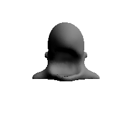

# X-Mesh 

[【Paper】](https://arxiv.org/abs/2303.15764)  [【Project Page】](https://xmu-xiaoma666.github.io/Projects/X-Mesh/)

A pytorch implementation of "X-Mesh: Towards Fast and Accurate Text-driven 3D Stylization via Dynamic Textual Guidance"

## Overview


## Getting Started
### Installation

**Note:** The below installation will fail if run on something other than a CUDA GPU machine.
```
conda env create --file xmesh.yml
conda activate xmesh
```
If you experience an error installing kaolin saying something like `nvcc not found`, you may need to set your `CUDA_HOME` environment variable to the 11.3 folder i.e. `export CUDA_HOME=/usr/local/cuda-11.3`, then rerunning the installation. 

### System Requirements
- Python 3.9
- CUDA 11
- GPU w/ minimum 8 GB ram

### Dataset
The dataset has been placed in `./Dataset`.
There are two folders in this path:
- `mesh_MIT30` : this folder contains 30 kinds of meshes.
- `prompt_MIT30` : this folder contains annotated prompts for meshes.

### Run examples
#### Training One Mesh
```bash
python main.py --run branch --obj_path <your .obj path> --output_dir <output dir> --prompt "<yout target prompt>" --sigma 12.0  --clamp tanh --n_normaugs 4 --n_augs 1 --normmincrop 0.1 --normmaxcrop 0.4 --geoloss --colordepth 2 --normdepth 2 --frontview --frontview_std 4 --clipavg view --lr_decay 0.9 --clamp tanh --normclamp tanh --save_render --seed 23 --n_iter 1200 --normal_learning_rate 0.0005 --standardize --no_pe --symmetry --background 1 1 1

```


#### Training Code for MIT-30
Call the below shell scripts to generate styled results on the MIT-30 dataset.
```bash
# generate results for MIT-30
./script/train.sh

```
The outputs will be saved to `./output`, with the stylized .obj files, colored and uncolored render views, and screenshots during training.
#### Evaluation Code
**Test MSE**

First generate rendered images from 24 fixed angles, you can run following sctipt:
```bash
# '--data_path' is the saving path that you set during your training
# '--out_path' is the path that you want to save 24 rendered images

python generate_multiviews.py --data_path <data_path> --out_path <out_path>

```
Then you can calculate the MSE metric via running following script:
```bash
# '--out_path' is the path that you save 24 rendered images in the last step
python test_MSE.py --out_path <out_path>

```

**Test ITS**

First, save all MSE for all iterations to a .json file:
```bash
# '--data_path' is the saving path that you set during your training
python save_similarity.py --data_path <data_path>

```

Finally, we calculate the ITS metric:
```bash
# '--threshold' is the MSE threshold for ITS
python test_ITS.py --threshold <threshold>

```


### Outputs


<p float="center">


</p>
<p float="center">
A 3D rendering of a wooden phoenix in unreal engine.
</p>


<p float="center">


</p>
<p float="center">
A 3D rendering of a dark castle in unreal engine.
</p>


<p float="center">


</p>
<p float="center">
A 3D rendering of a Ginger cat with black collar in unreal engine.
</p>


<p float="center">



</p>
<p float="center">
A 3D rendering of a BlueWhale in unreal engine.
</p>


<p float="center">


</p>
<p float="center">
A 3D rendering of a brown owl standing on a trunk in unreal engine.
</p>

<p float="center">


</p>
<p float="center">
A 3D rendering of a crocodile in unreal engine.
</p>


## Citation
```
@misc{ma2023xmesh,
      title={X-Mesh: Towards Fast and Accurate Text-driven 3D Stylization via Dynamic Textual Guidance}, 
      author={Yiwei Ma and Xiaioqing Zhang and Xiaoshuai Sun and Jiayi Ji and Haowei Wang and Guannan Jiang and Weilin Zhuang and Rongrong Ji},
      year={2023},
      eprint={2303.15764},
      archivePrefix={arXiv},
      primaryClass={cs.CV}
}
```