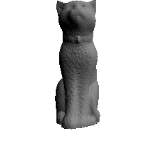

# X-Mesh

[【Paper】](https://arxiv.org/abs/2303.15764)  [【Project Page】](https://xmu-xiaoma666.github.io/Projects/X-Mesh/)

A pytorch implementation of “ X-Mesh: Towards Fast and Accurate Text-driven 3D Stylization via Dynamic Textual Guidance”

Code is coming ...


## Overview


## Outputs


<p float="center">


</p>
<p float="center">
A 3D rendering of a wooden phoenix in unreal engine.
</p>


<p float="center">


</p>
<p float="center">
A 3D rendering of a dark castle in unreal engine.
</p>


<p float="center">



</p>
<p float="center">
A 3D rendering of a Ginger cat with black collar in unreal engine.
</p>


<p float="center">


</p>
<p float="center">
A 3D rendering of a BlueWhale in unreal engine.
</p>


<p float="center">


</p>
<p float="center">
A 3D rendering of a brown owl standing on a trunk in unreal engine.
</p>

<p float="center">


</p>
<p float="center">
A 3D rendering of a crocodile in unreal engine.
</p>


## Citation
```
@misc{ma2023xmesh,
      title={X-Mesh: Towards Fast and Accurate Text-driven 3D Stylization via Dynamic Textual Guidance}, 
      author={Yiwei Ma and Xiaioqing Zhang and Xiaoshuai Sun and Jiayi Ji and Haowei Wang and Guannan Jiang and Weilin Zhuang and Rongrong Ji},
      year={2023},
      eprint={2303.15764},
      archivePrefix={arXiv},
      primaryClass={cs.CV}
}
```